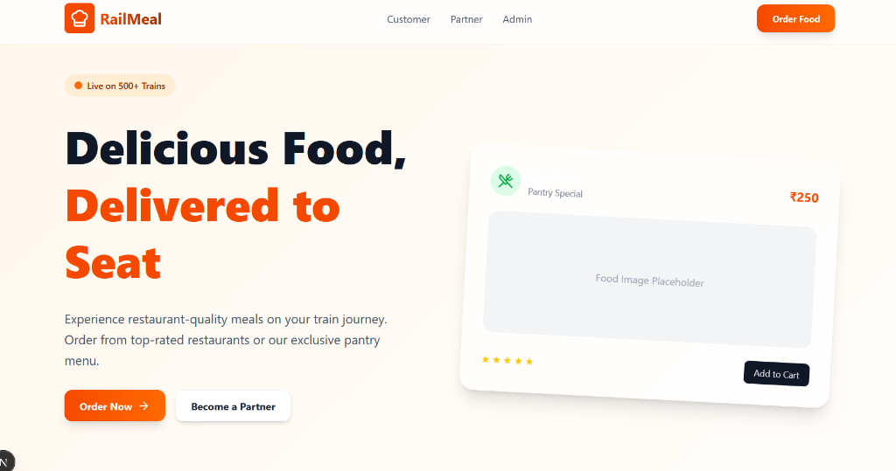

# PG-DAC PROJECT REPORT

## RAILMEAL - TRAIN FOOD ORDERING SYSTEM

---

**Centre Name:** [Your Centre Name]  
**Batch:** [Your Batch - e.g., September 2024]  

**Submitted By:**  
- [Your Name] - [Roll Number]  
- [Team Member 2] - [Roll Number]  
- [Team Member 3] - [Roll Number]  

**Project Guide:** [Guide Name]  
**Submission Date:** January 2026

---

## CERTIFICATE

This is to certify that the project titled **"RailMeal - Train Food Ordering System"** has been successfully completed by the above-mentioned students of PG-DAC [Batch] at [Centre Name] as partial fulfillment of the course requirements.

---

## ACKNOWLEDGEMENT

We would like to express our sincere gratitude to our project guide [Guide Name] for their valuable guidance and constant support throughout the project development. We also thank [Centre Name] and C-DAC for providing us with the opportunity and resources to work on this project.

---

## TABLE OF CONTENTS

1. Introduction
2. Problem Statement
3. Objectives
4. System Scope
5. Technology Stack
6. System Architecture
7. Database Design
8. Module Description
9. Screenshots
10. Testing
11. Future Enhancements
12. Conclusion
13. References

---

## 1. INTRODUCTION

**RailMeal** is a comprehensive Train Food Ordering System designed to provide passengers with a seamless food ordering experience during their train journey. The system integrates with PNR (Passenger Name Record) lookup to identify the train route and enables passengers to order food from restaurants available at upcoming stations or from the train's onboard pantry.

The application follows a modern microservices-inspired architecture with a Spring Boot backend and Next.js frontend, providing a responsive and user-friendly interface for customers, vendors, and administrators.

---

## 2. PROBLEM STATEMENT

Train passengers often face challenges in getting quality food during their journey:
- Limited options in train pantry
- Difficulty in finding restaurants at stations
- No way to pre-order food for delivery at stations
- Lack of real-time order tracking
- Payment inconveniences

**RailMeal** addresses these challenges by providing:
- PNR-based station identification
- Restaurant discovery at upcoming stations
- Online ordering with multiple payment options
- Real-time order tracking
- Digital wallet for convenient payments

---

## 3. OBJECTIVES

1. Develop a user-friendly food ordering platform for train passengers
2. Implement PNR lookup for automatic train and station identification
3. Enable restaurant discovery based on train route
4. Provide multiple payment options including Razorpay and Wallet
5. Implement real-time order tracking
6. Create separate portals for Users, Vendors, Pantry, and Admin
7. Ensure secure authentication using JWT

---

## 4. SYSTEM SCOPE

### 4.1 In Scope
- User registration and authentication
- PNR lookup and train search
- Restaurant browsing and food ordering
- Cart management and checkout
- Multiple payment methods (Razorpay, Wallet, COD)
- Order tracking and history
- Review and rating system
- Vendor dashboard for order management
- Admin panel for system management
- Wallet management with transactions

### 4.2 Out of Scope
- Real IRCTC API integration
- GPS-based live train tracking
- Map API integration (Google Maps, etc.)
- Third-party delivery integration

> **Note:** The application stores latitude/longitude coordinates for stations and delivery tracking, but does not integrate with any external Map API for visualization.

---

## 5. TECHNOLOGY STACK

### 5.1 Frontend
| Technology | Version | Purpose |
|------------|---------|---------|
| Next.js | 16.0.3 | React Framework |
| React | 19.2.0 | UI Library |
| TailwindCSS | 4.x | Styling |
| Framer Motion | 12.23.24 | Animations |
| Lucide React | 0.554.0 | Icons |

### 5.2 Backend
| Technology | Version | Purpose |
|------------|---------|---------|
| Spring Boot | 3.1.5 | Backend Framework |
| Java | 17 | Programming Language |
| Spring Security | 6.x | Authentication |
| Spring Data JPA | 3.x | ORM |
| JWT (jjwt) | 0.11.5 | Token Authentication |
| Lombok | 1.18.30 | Code Generation |

### 5.3 Database
| Technology | Version | Purpose |
|------------|---------|---------|
| MySQL | 8.0 | Relational Database |

### 5.4 Payment Gateway
| Technology | Purpose |
|------------|---------|
| Razorpay | Online Payment Processing |

### 5.5 DevOps
| Technology | Purpose |
|------------|---------|
| Docker | Containerization |
| Docker Compose | Container Orchestration |

---

## 6. SYSTEM ARCHITECTURE

### 6.1 Architecture Diagram

```
┌─────────────────────────────────────────────────────────────┐
│                     CLIENT LAYER                             │
│  ┌─────────┐  ┌─────────┐  ┌─────────┐  ┌─────────┐        │
│  │  User   │  │ Vendor  │  │  Admin  │  │ Pantry  │        │
│  │ Portal  │  │ Portal  │  │ Portal  │  │ Portal  │        │
│  └────┬────┘  └────┬────┘  └────┬────┘  └────┬────┘        │
│       │            │            │            │              │
│       └────────────┴─────┬──────┴────────────┘              │
│                          │                                   │
│               ┌──────────▼──────────┐                       │
│               │   Next.js Frontend   │                       │
│               │      (Port 3000)     │                       │
│               └──────────┬──────────┘                       │
└──────────────────────────┼──────────────────────────────────┘
                           │ REST API (HTTP/JSON)
┌──────────────────────────┼──────────────────────────────────┐
│                          │                                   │
│               ┌──────────▼──────────┐                       │
│               │  Spring Boot Backend │                       │
│               │      (Port 8080)     │                       │
│               └──────────┬──────────┘                       │
│                          │                                   │
│  ┌───────────────────────┼───────────────────────┐          │
│  │                       │                       │          │
│  ▼                       ▼                       ▼          │
│ ┌────────┐        ┌─────────────┐         ┌──────────┐      │
│ │Security│        │  Services   │         │Controllers│     │
│ │  JWT   │        │(Business    │         │(REST API) │     │
│ └────────┘        │  Logic)     │         └──────────┘      │
│                   └──────┬──────┘                           │
│                          │                                   │
│               ┌──────────▼──────────┐                       │
│               │    Repositories     │                       │
│               │    (Spring JPA)     │                       │
│               └──────────┬──────────┘                       │
│                          │                                   │
└──────────────────────────┼──────────────────────────────────┘
                           │
┌──────────────────────────┼──────────────────────────────────┐
│               ┌──────────▼──────────┐                       │
│               │   MySQL Database    │                       │
│               │     (Port 3306)     │                       │
│               └─────────────────────┘                       │
│                     DATA LAYER                               │
└─────────────────────────────────────────────────────────────┘
```

### 6.2 Component Architecture

The application follows a **layered architecture**:

1. **Presentation Layer** - Next.js Frontend
2. **API Layer** - Spring Boot REST Controllers
3. **Service Layer** - Business Logic Services
4. **Repository Layer** - Data Access using JPA
5. **Database Layer** - MySQL Database

---

## 7. DATABASE DESIGN

### 7.1 Entity Relationship Diagram (Conceptual)

```
┌──────────┐       ┌──────────┐       ┌──────────┐
│   User   │───────│  Order   │───────│OrderItem │
└──────────┘       └──────────┘       └──────────┘
     │                  │                   │
     │                  │                   │
     ▼                  ▼                   ▼
┌──────────┐       ┌──────────┐       ┌──────────┐
│  Wallet  │       │ Payment  │       │ FoodItem │
└──────────┘       └──────────┘       └──────────┘
                        │                   │
                        │                   │
                        ▼                   ▼
                   ┌──────────┐       ┌──────────┐
                   │  Review  │       │Restaurant│
                   └──────────┘       └──────────┘
                                           │
                                           ▼
                                      ┌──────────┐
                                      │ Station  │
                                      └──────────┘
                                           │
                                           ▼
┌──────────┐       ┌──────────┐       ┌──────────┐
│   Pnr    │───────│  Train   │───────│TrainRoute│
└──────────┘       └──────────┘       └──────────┘
```

### 7.2 Database Tables

| Table Name | Description |
|------------|-------------|
| users | User accounts and credentials |
| roles | User roles (USER, ADMIN, VENDOR) |
| orders | Customer orders |
| order_items | Items in each order |
| food_items | Menu items |
| restaurants | Restaurant information |
| stations | Railway stations |
| trains | Train information |
| train_routes | Train route mappings |
| pnr | PNR records |
| payments | Payment transactions |
| wallets | User wallet balances |
| wallet_transactions | Wallet transaction history |
| reviews | Customer reviews |
| pantry | Train pantry information |
| pantry_inventory | Pantry stock |
| delivery_persons | Delivery personnel |
| order_tracking | Order status tracking |
| support_tickets | Customer support tickets |

---

## 8. MODULE DESCRIPTION

### 8.1 User Module
- **Registration/Login** - JWT-based authentication
- **PNR Lookup** - Search train by PNR
- **Train Search** - Search trains by name/number
- **Service Selection** - Choose E-Catering or Pantry
- **Restaurant Browse** - View restaurants at stations
- **Food Ordering** - Add to cart and checkout
- **Payment** - Razorpay/Wallet/COD
- **Order Tracking** - Real-time order status
- **Order History** - View past orders
- **Reviews** - Rate and review orders
- **Wallet** - Add money and view transactions
- **Profile** - Manage user profile

### 8.2 Vendor Module
- **Dashboard** - Overview of orders and stats
- **Menu Management** - Add/Edit/Delete food items
- **Order Management** - View and update order status
- **Restaurant Profile** - Manage restaurant details

### 8.3 Admin Module
- **Dashboard** - System overview and analytics
- **User Management** - Manage all users
- **Restaurant Management** - Approve/manage restaurants
- **Order Monitoring** - Track all orders
- **Train Management** - Manage train data
- **Station Management** - Manage station data

### 8.4 Pantry Module
- **Inventory Management** - Stock management
- **Order Processing** - Handle pantry orders
- **Menu Management** - Pantry menu items

---

## 9. SCREENSHOTS

### 9.1 Home Page
The landing page showcases the RailMeal branding with a modern design featuring the tagline "Delicious Food, Delivered to Seat". Users can see live train coverage (500+ trains) and sample food items.



### 9.2 User Dashboard
*[Screenshot of user dashboard]*

### 9.3 PNR Lookup
*[Screenshot of PNR search]*

### 9.4 Restaurant Listing
*[Screenshot of restaurants]*

### 9.5 Food Menu
*[Screenshot of menu page]*

### 9.6 Cart & Checkout
*[Screenshot of checkout]*

### 9.7 Payment Gateway
*[Screenshot of Razorpay]*

### 9.8 Order Tracking
*[Screenshot of tracking]*

### 9.9 Vendor Dashboard
*[Screenshot of vendor panel]*

### 9.10 Admin Panel
*[Screenshot of admin panel]*

---

## 10. TESTING

### 10.1 Unit Testing
- JUnit tests for service layer
- Repository layer testing

### 10.2 Integration Testing
- API endpoint testing
- Database integration tests

### 10.3 Functional Testing

| Test Case | Description | Expected Result | Status |
|-----------|-------------|-----------------|--------|
| TC001 | User Registration | User created successfully | ✓ Pass |
| TC002 | User Login | JWT token generated | ✓ Pass |
| TC003 | PNR Lookup | Train details returned | ✓ Pass |
| TC004 | Add to Cart | Item added to cart | ✓ Pass |
| TC005 | Place Order | Order created | ✓ Pass |
| TC006 | Payment Processing | Payment successful | ✓ Pass |
| TC007 | Order Tracking | Status updated | ✓ Pass |
| TC008 | Add Review | Review saved | ✓ Pass |
| TC009 | Wallet Recharge | Balance updated | ✓ Pass |
| TC010 | Vendor Order Update | Status changed | ✓ Pass |

---

## 11. FUTURE ENHANCEMENTS

1. **Real IRCTC Integration** - Connect with actual IRCTC APIs
2. **GPS Tracking** - Live train location tracking
3. **Push Notifications** - Real-time order updates
4. **Mobile App** - React Native mobile application
5. **AI Recommendations** - ML-based food suggestions
6. **Multiple Languages** - Multi-language support
7. **Voice Ordering** - Voice-based food ordering
8. **Loyalty Program** - Rewards and discounts

---

## 12. CONCLUSION

**RailMeal** successfully demonstrates a comprehensive solution for train food ordering. The project implements:

- Modern full-stack architecture with Spring Boot and Next.js
- Secure JWT-based authentication
- Multiple payment options with Razorpay integration
- Real-time order tracking
- Role-based access for Users, Vendors, and Admins
- Docker containerization for easy deployment

The project provides a practical solution to real-world challenges faced by train passengers and showcases the application of PG-DAC curriculum technologies.

---

## 13. REFERENCES

1. Spring Boot Documentation - https://spring.io/projects/spring-boot
2. Next.js Documentation - https://nextjs.org/docs
3. Razorpay Integration Guide - https://razorpay.com/docs/
4. MySQL Documentation - https://dev.mysql.com/doc/
5. Docker Documentation - https://docs.docker.com/
6. JWT.io - https://jwt.io/

---

## APPENDIX A: API ENDPOINTS

### Authentication APIs
| Method | Endpoint | Description |
|--------|----------|-------------|
| POST | /api/auth/register | User registration |
| POST | /api/auth/login | User login |

### Train APIs
| Method | Endpoint | Description |
|--------|----------|-------------|
| GET | /api/trains/pnr/{pnr} | PNR lookup |
| GET | /api/trains/search | Search trains |

### Restaurant APIs
| Method | Endpoint | Description |
|--------|----------|-------------|
| GET | /api/restaurants | List restaurants |
| GET | /api/restaurants/{id}/menu | Get menu |

### Order APIs
| Method | Endpoint | Description |
|--------|----------|-------------|
| POST | /api/orders | Create order |
| GET | /api/orders/{id} | Get order details |
| GET | /api/orders/tracking/{id} | Track order |

### Payment APIs
| Method | Endpoint | Description |
|--------|----------|-------------|
| POST | /api/payments/create-order | Create payment |
| POST | /api/payments/verify | Verify payment |

### Wallet APIs
| Method | Endpoint | Description |
|--------|----------|-------------|
| GET | /api/wallet | Get wallet balance |
| POST | /api/wallet/add | Add money |

---

## APPENDIX B: PROJECT SETUP

### Prerequisites
- Java 17
- Node.js 18+
- MySQL 8.0
- Maven

### Backend Setup
```bash
cd food_ordering-1
./mvnw spring-boot:run
```

### Frontend Setup
```bash
cd raildine/raildine
npm install
npm run dev
```

### Docker Setup
```bash
docker-compose up -d
```

---

*End of Report*
